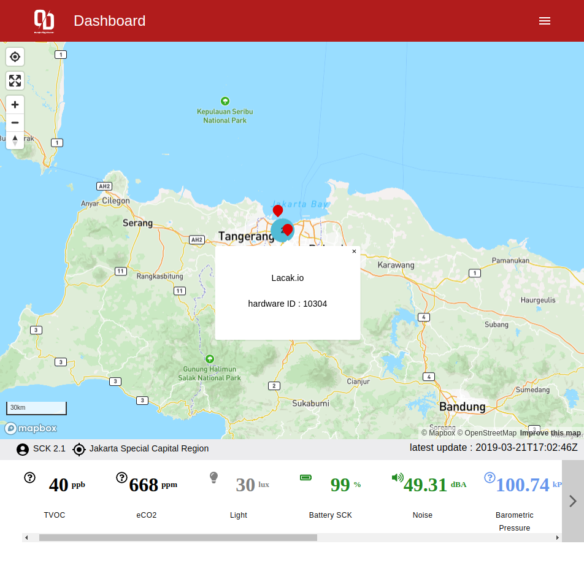

<div align="center">

<h1 style="border-bottom: none">
    <b><a href="https://github.com/Outsmarting-Disaster/OD-Dashboard">OD-Dashboard</a></b><br />
   all in one data visualization & monitoring portal
    <br>
</h1>

<div>


 

</div>

<div align='left'>

## Getting Started

```bash
yarn && yarn dev
```

## Credits 🎉

Big thanks to this great repo - [fablabbcn/Smartcitizen](https://github.com/fablabbcn)

## License

This project is licensed under MIT.
</div>